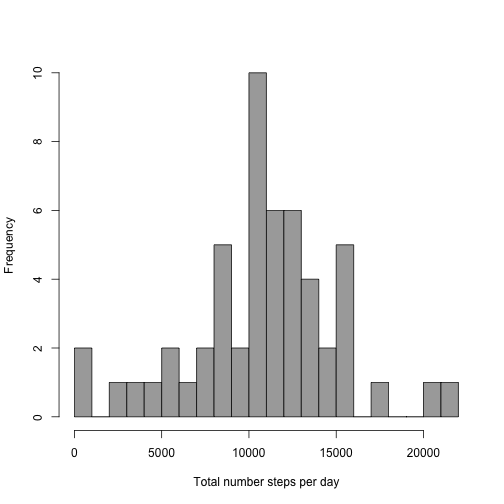
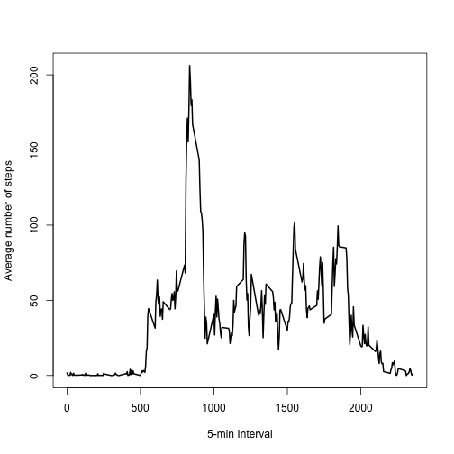
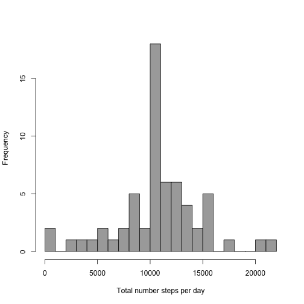
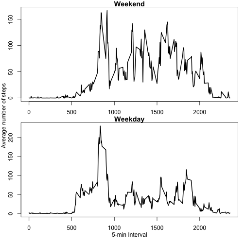

This is an R Markdown document that will load the activity.csv file, run some basic analyses and create some exploratory plots. This analysis requires the use of the lubridate package. 

First we will **load the data** and look at a **summary** of the variables:


```r
activity <- read.csv("./activity.csv")
summary(activity)
```

```
##      steps                date          interval     
##  Min.   :  0.00   2012-10-01:  288   Min.   :   0.0  
##  1st Qu.:  0.00   2012-10-02:  288   1st Qu.: 588.8  
##  Median :  0.00   2012-10-03:  288   Median :1177.5  
##  Mean   : 37.38   2012-10-04:  288   Mean   :1177.5  
##  3rd Qu.: 12.00   2012-10-05:  288   3rd Qu.:1766.2  
##  Max.   :806.00   2012-10-06:  288   Max.   :2355.0  
##  NA's   :2304     (Other)   :15840
```

We see that there are 2304 NAs in the steps variable, so we may have to deal with that later. Also, because the date variable is currently coded as a factor variable, we'll use the lubridate package to **transform date** into a true date variable


```r
library(lubridate)
activity$date <- ymd(activity$date)
summary(activity)
```

```
##      steps             date               interval     
##  Min.   :  0.00   Min.   :2012-10-01   Min.   :   0.0  
##  1st Qu.:  0.00   1st Qu.:2012-10-16   1st Qu.: 588.8  
##  Median :  0.00   Median :2012-10-31   Median :1177.5  
##  Mean   : 37.38   Mean   :2012-10-31   Mean   :1177.5  
##  3rd Qu.: 12.00   3rd Qu.:2012-11-15   3rd Qu.:1766.2  
##  Max.   :806.00   Max.   :2012-11-30   Max.   :2355.0  
##  NA's   :2304
```

###To analyze the mean total number of steps per day

Here, we **calculate the total number of steps taken per day** using the aggregate function and then print out the new dataset summarized by date. We can ignore the missing data in the steps variable for this portion of the analysis (omitting the NAs is the default in the aggregate function). 


```r
by_date <- aggregate(steps ~ date, data=activity, sum)
by_date
```

```
##          date steps
## 1  2012-10-02   126
## 2  2012-10-03 11352
## 3  2012-10-04 12116
## 4  2012-10-05 13294
## 5  2012-10-06 15420
## 6  2012-10-07 11015
## 7  2012-10-09 12811
## 8  2012-10-10  9900
## 9  2012-10-11 10304
## 10 2012-10-12 17382
## 11 2012-10-13 12426
## 12 2012-10-14 15098
## 13 2012-10-15 10139
## 14 2012-10-16 15084
## 15 2012-10-17 13452
## 16 2012-10-18 10056
## 17 2012-10-19 11829
## 18 2012-10-20 10395
## 19 2012-10-21  8821
## 20 2012-10-22 13460
## 21 2012-10-23  8918
## 22 2012-10-24  8355
## 23 2012-10-25  2492
## 24 2012-10-26  6778
## 25 2012-10-27 10119
## 26 2012-10-28 11458
## 27 2012-10-29  5018
## 28 2012-10-30  9819
## 29 2012-10-31 15414
## 30 2012-11-02 10600
## 31 2012-11-03 10571
## 32 2012-11-05 10439
## 33 2012-11-06  8334
## 34 2012-11-07 12883
## 35 2012-11-08  3219
## 36 2012-11-11 12608
## 37 2012-11-12 10765
## 38 2012-11-13  7336
## 39 2012-11-15    41
## 40 2012-11-16  5441
## 41 2012-11-17 14339
## 42 2012-11-18 15110
## 43 2012-11-19  8841
## 44 2012-11-20  4472
## 45 2012-11-21 12787
## 46 2012-11-22 20427
## 47 2012-11-23 21194
## 48 2012-11-24 14478
## 49 2012-11-25 11834
## 50 2012-11-26 11162
## 51 2012-11-27 13646
## 52 2012-11-28 10183
## 53 2012-11-29  7047
```

Then we make a histogram (not barplot!) of the total number of steps taken each day


```r
hist(by_date$steps, breaks=20, xlab="Total number steps per day", main="", col="dark grey")
```

 
This histogram shows the frequency of days with various total numbers of steps taken on that day. For example, there were two days where the number of steps was between 0 and 1000. Looking at the above print out of the data summed by day, we can tell that these two days are October 2nd (total = 126 steps) and November 15th (total = 41 steps).


Finally for this section, we calculate and report the mean and median of the total number of steps taken per day after removing the NAs

```r
mean(by_date$steps, na.rm=TRUE)
```

```
## [1] 10766.19
```

```r
median(by_date$steps, na.rm=TRUE)
```

```
## [1] 10765
```

Our second objective is to assess:


###What is the average daily activity pattern?

We accomplish this by first aggregating the average number of steps in each 5 minute interval across all the days in the dataset


```r
by_interval<- aggregate(steps ~ interval, data=activity, mean)
```

Then we make a time series plot showing the 5-minute intervals on the x-axis and the average number of steps averaged across all days in that per interval on the y-axis


```r
plot(by_interval$steps ~ by_interval$interval, typ="l", lwd=2, xlab="5-min Interval", ylab="Average number of steps")
```

 

Finally, we'd like to know which 5-minute interval, averaged across all the days in the dataset, contains the maximum number of steps


```r
which(by_interval$steps == max(by_interval$steps))
```

```
## [1] 104
```

```r
by_interval[104,]
```

```
##     interval    steps
## 104      835 206.1698
```
So, we know that interval number 835 has the most steps with an average of 206.17 steps taken in that interval averaged over all the days of the study


###Imputing missing values
Because the presence of missing data may introduce bias into some calculations or summaries of the data and this dataset has some missing observations (coded as NA), we will need to fill them in somehow.

First we will **calculate the number of missing observations**

```r
summary(activity$steps)
```

```
##    Min. 1st Qu.  Median    Mean 3rd Qu.    Max.    NA's 
##    0.00    0.00    0.00   37.38   12.00  806.00    2304
```
So we now know that there are 2304 day/interval observations (rows in the dataset) that are missing the number of steps taken. To take care of this we will need to impute the missing values with the average number of steps taken per 5-minute interval as calculated above.

We start by renaming the steps variable from the byinterval dataset so that we can append byinterval onto the original dataset without getting the two steps variables confused


```r
names(by_interval)[2] <- "avg.steps"
```

Now we combine the byinterval dataset with the activity dataset and check the names to make sure avg.steps is present


```r
combine <- merge(activity, by_interval)
names(combine)
```

```
## [1] "interval"  "steps"     "date"      "avg.steps"
```
Now we have an average steps per interval variable for each observation in the original dataset


Now we **impute**, taking any rows from the combine dataset where there is NA in the steps variable and replace the NA with the avg.step from the same row (rounded so there are no decimals so these imputed observations look like the other observations). We then delete the avg.steps variable from the combine dataset and then look at to make sure everything went as expected.


```r
combine$steps[is.na(combine$steps)] <- round(combine$avg.steps[is.na(combine$steps)], 0)
#then delete the average steps column to get the original dataset back
combine$avg.steps <- NULL 
summary(combine)
```

```
##     interval          steps             date           
##  Min.   :   0.0   Min.   :  0.00   Min.   :2012-10-01  
##  1st Qu.: 588.8   1st Qu.:  0.00   1st Qu.:2012-10-16  
##  Median :1177.5   Median :  0.00   Median :2012-10-31  
##  Mean   :1177.5   Mean   : 37.38   Mean   :2012-10-31  
##  3rd Qu.:1766.2   3rd Qu.: 27.00   3rd Qu.:2012-11-15  
##  Max.   :2355.0   Max.   :806.00   Max.   :2012-11-30
```
Now there are no more missing values in the combine dataset


Next we make a **histogram of the total number of steps taken each day**. First we need to use the aggregate function again to create the total steps per day dataset.


```r
by_date_nona <- aggregate(steps ~ date, data=combine, FUN=sum)
hist(by_date_nona$steps, breaks=20, xlab="Total number steps per day", main="", col="dark grey")
```

 

This histogram looks very similar to the one from before. Let's calculate and report the mean and median total number of steps taken per day just as we did before, but now using the imputed dataset to **compare the mean and median** of the imputed dataset to those from the original dataset.


```r
mean(by_date_nona$steps)
```

```
## [1] 10765.64
```

```r
median(by_date_nona$steps)
```

```
## [1] 10762
```
Here were the mean and median without imputation


```r
mean(by_date$steps, na.rm=TRUE)
```

```
## [1] 10766.19
```

```r
median(by_date$steps, na.rm=TRUE)
```

```
## [1] 10765
```

We see that the two sets of descriptive stats are very, very close. This is excellent since it means that excluding the missing values and imputing them using the average steps per 5-min interval both resulted in similar means and medians. Now we can feel confident using our imputed dataset for further analyses that require having no missings.


###Differences in activity patterns between weekdays and weekends
For this analysis we will use the imputed dataset


To start, we **create a new weekdays factor variable** using the weekdays and factor functions

```r
combine$weekday <- weekdays(combine$date)
names(combine)
```

```
## [1] "interval" "steps"    "date"     "weekday"
```

```r
combine$weekday <- as.factor(combine$weekday)
str(combine$weekday)
```

```
##  Factor w/ 7 levels "Friday","Monday",..: 2 1 4 6 3 5 3 1 7 4 ...
```
Then we change the levels of this factor variable into **"weekend" and "weekday"**

```r
levels(combine$weekday) <- list(weekend =c("Saturday", "Sunday"), weekday = c("Monday", "Tuesday", "Wednesday", "Thursday", "Friday"))
levels(combine$weekday)
```

```
## [1] "weekend" "weekday"
```

Now to see the differences between the average number of steps taken between weekday days or weekend days, we will use the aggregate function on subsets of the data to **calculate the average steps per interval for weekends or weekdays**

```r
weekend <- subset(combine, subset=combine$weekday=="weekend")
weekday <- subset(combine, subset=combine$weekday=="weekday")
weekend_by_interval<- aggregate(steps ~ interval, data=weekend, mean)
weekday_by_interval<- aggregate(steps ~ interval, data=weekday, mean)
```

Now we visualize the differences via a **panel plot** containing a time series plot (type = "l") of the 5-minute interval (x-axis) and the average number of steps taken, averaged across all weekday days or weekend days (y-axis)


```r
par(mar=c(2,1,1,1), oma=c(2,2,0,0), mfrow=c(2,1))
plot(weekend_by_interval$steps ~ weekend_by_interval$interval, typ="l", lwd=2, main = "Weekend", xlab="", ylab="")
plot(weekday_by_interval$steps ~ weekday_by_interval$interval, typ="l", lwd=2, main = "Weekday", xlab="", ylab="")
?mtext
mtext("Average number of steps", side=2, outer=TRUE, line=1)
mtext("5-min Interval", side=1, outer=TRUE, line=0)
```

 
We can see that there are large differences in the average number of steps per 5-min interval between weekends and weekdays. On average over the study people took  more steps in intervals between 1000 and 2000 (i.e., the afternoons) of the weekend days.
